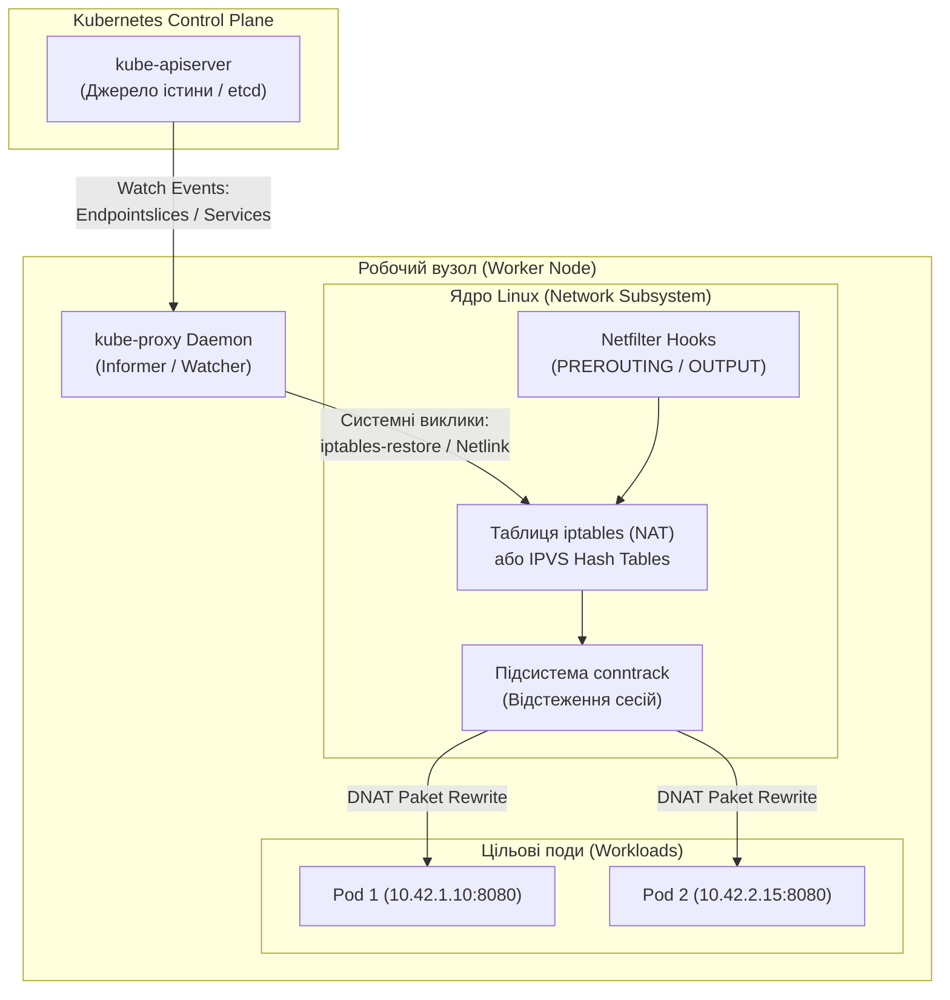
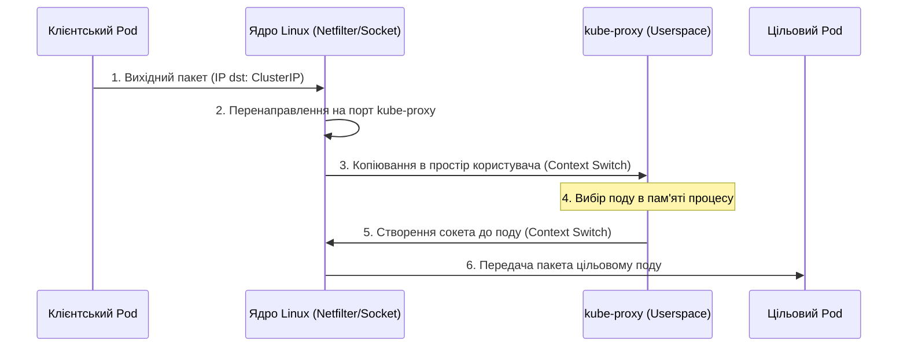
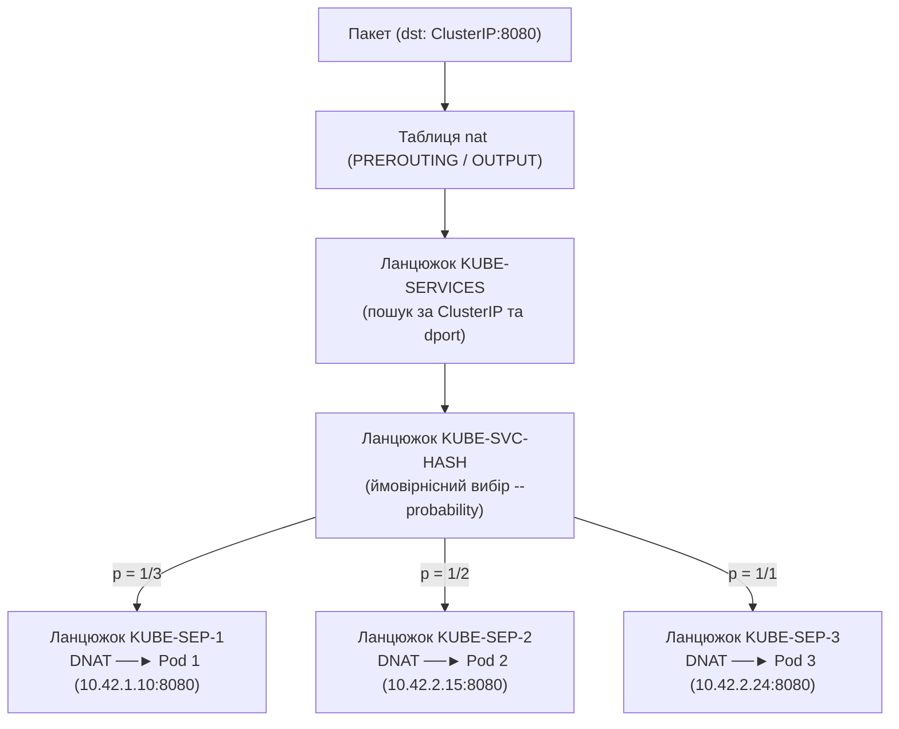
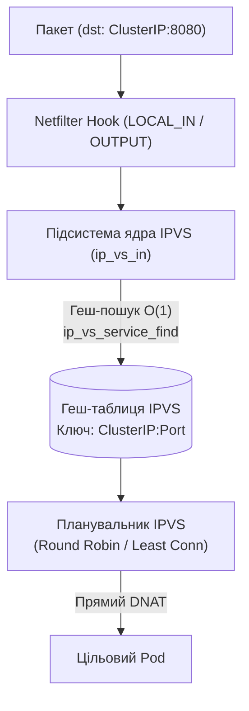
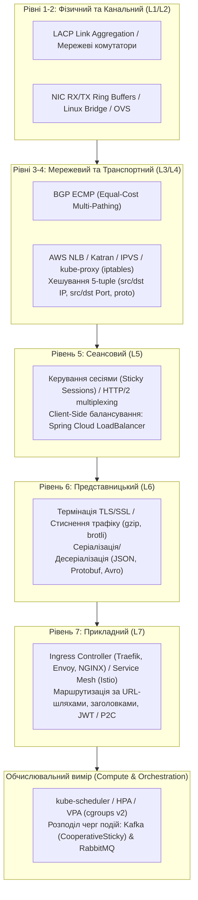
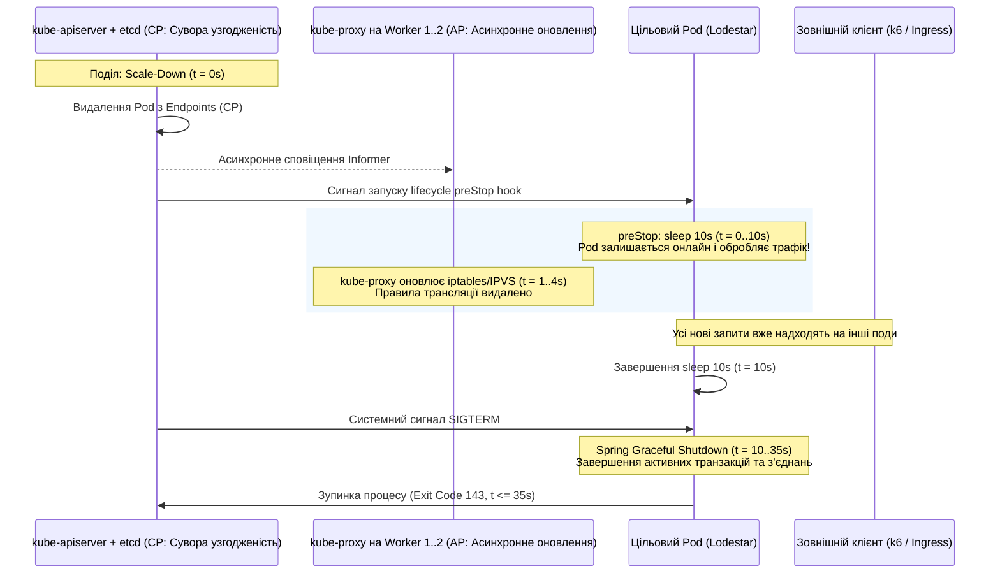

### Анотація

У хмарних розподілених системах балансування навантаження часто сприймається як утилітарна функція інфраструктури, що налаштовується декларативними маніфестами. Проте реальна поведінка трафіку в кластері Kubernetes визначається взаємодією низькорівневих механізмів ядра операційної системи Linux (Netfilter, iptables, IPVS) та фундаментальними законами теорії масового обслуговування.

Ця робота пропонує наскрізний інженерний аналіз балансування трафіку в Kubernetes -- від фізичної відсутності віртуального сокета `ClusterIP` до алгоритмічних меж $O(N)$ та $O(1)$ у ядрі. У статті зіставлено мережеві рівні з Еталонною моделлю взаємодії відкритих систем (ЕМВВС / OSI), формалізовано цільову функцію багатокритеріальної оптимізації хмари $E = \sum w_i M_i$ та емпірично валідовано теорему Мітценмахера про дві вибірки (Power of Two Choices) за допомогою дослідницького L7-балансувальника на віртуальних потоках Java 21 (Project Loom). Практичні висновки підтверджено натурним стрес-тестом у кластері `k3d` під навантаженням інструменту `k6`.

## Вступ

### Фізична та логічна сутність ClusterIP

У розподілених системах на базі Kubernetes однією з найпоширеніших ментальних пасток для інженерів є уявлення про `ClusterIP` як про звичайний мережевий інтерфейс, призначений певному процесу або віртуальній машині. Інтуїтивно очікується, що коли в кластері створюється сервіс типу:

```yaml
apiVersion: v1
kind: Service
metadata:
  name: lodestar-service
spec:
  type: ClusterIP
  ports:
    - port: 8080
      targetPort: 8080
  selector:
    app: lodestar
```

і Kubernetes виділяє йому IP-адресу (наприклад, `10.43.80.181`), то десь в операційній системі має з'явитися мережевий сокет, що прослуховує порт 8080. Проте безпосередня інспекція операційної системи на будь-якому вузлі кластера спростовує цю гіпотезу:

```bash
# 1. Перевірка мережевих інтерфейсів ноди
$ ip addr show | grep 10.43.80.181
# Результат: порожній вивід

# 2. Перевірка відкритих портів операційної системи
$ ss -tulpn | grep 8080
# Результат: жодного процесу, який би слухав 10.43.80.181:8080
```

Адреса `10.43.80.181` фізично не існує на жодному мережевому адаптері, віртуальному мосту (`bridge`) чи veth-парі. Ба більше, спроба надіслати ICMP-пакет (`ping 10.43.80.181`) зазвичай завершується 100% втратою пакетів, якщо ядро спеціально не налаштоване відповідати на такі запити.

З погляду комп'ютерної інженерії `ClusterIP` є чистою абстракцією простору імен ядра -- це віртуальний маркер у таблицях маршрутизації та трансляції мережевих адрес (Network Address Translation, NAT), який ніколи не виступає безпосередньою точкою завершення TCP-з'єднання. Коли клієнтський процес всередині пода ініціює системний виклик `connect()` до `10.43.80.181:8080`, операційна система не відправляє цей пакет через фізичну лінію зв'язку до віддаленого сервера. Натомість пакет перехоплюється внутрішніми підсистемами ядра Linux ще до моменту виходу в стек маршрутизації.

### Роль та системна будова kube-proxy

Для перетворення статичних абстракцій API Kubernetes у реальні правила перенаправлення трафіку в ядрі Linux використовується спеціалізований системний демон -- `kube-proxy`.

`kube-proxy` функціонує як агент на кожному робочому вузлі (Worker Node) та майстер-вузлі (Control Plane) кластера, зазвичай розгортаючись у формі системного `DaemonSet`. Його ключова архітектурна роль полягає не в безпосередній проміжній передачі байтів даних через себе (у сучасних режимах роботи), а у виконанні ролі контролера площини управління (Control Plane Agent) для мережевого стека локального ядра.



Механіка взаємодії `kube-proxy` базується на реактивному шаблоні Observer/Informer:
1. **Підписка на події API Server:** `kube-proxy` встановлює довготривале HTTP-з'єднання (Watch) з `kube-apiserver`, підписуючись на зміни двох фундаментальних ресурсів: `Service` та `EndpointSlice` (або застарілих `Endpoints`).
2. **Асинхронне виявлення змін топології:** Коли контролер розгортання масштабує поди сервісу або коли поди змінюють статус через непроходження Readiness probe, `kube-apiserver` надсилає дельта-подію про оновлення IP-адрес ендпоінтів.
3. **Програмування ядра:** Отримавши оновлення, `kube-proxy` транслює топологію розподіленої системи у низькорівневі інструкції ядра Linux (Netfilter/iptables, IPVS або eBPF).

## Еволюція механіки ядра

Балансування трафіку в Kubernetes пройшло кілька послідовних ітерацій, що відображають оптимізацію витрат обчислювальних ресурсів операційної системи.

### Режим Userspace: Подвійне перемикання контексту та копіювання буферів

На ранніх етапах розвитку Kubernetes (версії 1.0–1.1) демон `kube-proxy` функціонував як повноцінний проксі-сервер простору користувача (Userspace Proxy).



Вузькі місця підходу:
* **Подвійне перемикання контексту:** Кожен мережевий пакет двічі долав межу між простором ядра (`kernel-space`) та простором користувача (`user-space`).
* **Копіювання буферів пам'яті:** Байти переміщувалися з буферів ядра (`sk_buff`) у пам'ять процесу `kube-proxy` і назад.
* **Непродуктивне навантаження на CPU:** Процесор витрачав ресурси на системні виклики `read()`/`write()` та обробку переривань.

### Режим iptables: Netfilter, ланцюжки ймовірностей та лінійна деградація

Починаючи з Kubernetes 1.2, стандартним режимом роботи став `iptables mode`. У цьому режимі `kube-proxy` усувається зі шляху проходження пакетів (Data Path), а весь тягар балансування покладається на підсистему **Netfilter**.



#### Математична реалізація балансування через ймовірнісні фільтри
Для забезпечення рівномірного розподілу між $n$ бекендами ймовірність спрацьовування кожного правила в ланцюжку `KUBE-SVC-*` розраховується за формулою:

$$P(i) = \frac{1}{n - i + 1}, \quad \text{де } i \in \{1, 2, \dots, n\}$$

Для трьох реплік ($n = 3$):
1. **Правило 1:** $P_1 = \frac{1}{3 - 1 + 1} = \frac{1}{3} \approx 0.3333$.
2. **Правило 2:** $P_2 = \frac{1}{3 - 2 + 1} = \frac{1}{2} = 0.5$. Безумовна ймовірність: $\left(1 - \frac{1}{3}\right) \times \frac{1}{2} = \frac{1}{3}$.
3. **Правило 3:** $P_3 = 1.0$. Безумовна ймовірність: $\left(1 - \frac{1}{3}\right) \times \left(1 - \frac{1}{2}\right) \times 1.0 = \frac{1}{3}$.

#### Алгоритмічна деградація iptables: $O(N)$
1. **Лінійна часова складність пошуку $O(N)$:** Однозв'язний список правил змушує ядро послідовно порівнювати пакети з кожним правилом від початку списку. При зростанні до десятків тисяч правил зростає затримка обробки кожного пакета.
2. **Блокування ядра при оновленні:** `iptables-restore` вимагає захоплення блокування `xtables_lock` та перезапису всієї таблиці цілком, що паралізує оновлення мережевих конфігурацій при частих подіях масштабування.

### Режим IPVS (IP Virtual Server): $O(1)$

Режим **IPVS** (стабілізовано в K8s 1.11) замінює послідовні ланцюжки Netfilter на **геш-таблиці** ядра Linux:



| Характеристика | iptables Mode | IPVS Mode |
| :--- | :--- | :--- |
| **Базова структура даних** | Послідовний список правил (`linked list`) | **Геш-таблиці (`hash tables`)** |
| **Алгоритмічна складність пошуку** | **$O(N)$** | **$O(1)$** |
| **Механіка оновлення** | Повне перезаписування через `iptables-restore` із блокуванням `xtables_lock` | Атомарне оновлення окремих записів через **Netlink** |
| **Алгоритми розподілу** | Виключно псевдовипадковий вибір | Round Robin, Least Connection, Destination Hashing, Weighted |

IPVS забезпечує сталий час маршрутизації незалежно від масштабу кластера. Проте робота на рівні L4 зберігає фундаментальні обмеження щодо довгих сесій.

## Фундаментальні теореми та закони

### Теорема Мітценмахера: Сила двох виборів (Power of Two Choices)

Розподіл навантаження між $n$ вузлами формалізується класичною задачею розміщення куль по комірках:
1. **Випадок $d = 1$ (Чисто випадковий вибір, аналог iptables):**
   $$L_{\max}^{(d=1)} = \frac{\ln n}{\ln \ln n} \cdot (1 + o(1))$$
   Логарифмічна асимптотика породжує нерівномірність черг і локальні перевантаження окремих вузлів.
2. **Випадок $d = 2$ (Вибір із двох кандидатів, Mitzenmacher 2001):**
   $$L_{\max}^{(d=2)} = \frac{\ln \ln n}{\ln 2} + \Theta(1)$$
   Додавання вибору найкращого з двох кандидатів експоненційно скорочує максимальну довжину черги до подвійного логарифма без необхідності централізованого опитування всіх серверів.

### Закон Літтла ($L = \lambda W$) та сліпота рівня L4

Фундаментальний закон теорії масового обслуговування (John Little, 1961):

$$L = \lambda W$$

де $L$ -- середня кількість активних in-flight запитів, $\lambda$ -- інтенсивність потоку, $W$ -- середній час відгуку.

`kube-proxy` (L4) не має доступу до структури прикладних HTTP/gRPC запитів всередині мультиплексованого з'єднання і не здатний визначити $L$.

При сплеску до $\lambda = 10\,000$ RPS та $W = 0.2$ с система повинна одночасно утримувати $L = 2\,000$ активних завдань. Застосування **Java 21 Virtual Threads (Project Loom)** дозволяє тримати тисячі таких неблокуючих завдань у пам'яті JVM Heap без вичерпання ресурсів системних потоків ОС.

### Формула Кінгмана: Обґрунтування порогу HPA 60% CPU

Час очікування в черзі $G/G/1$ за формулою Кінгмана (1961):

$$W_q \approx \left(\frac{c_a^2 + c_s^2}{2}\right) \cdot \left(\frac{\rho}{1 - \rho}\right) \cdot \frac{1}{\mu}$$


*Рис. Залежність часу очікування в черзі $W_q$ від утилізації процесора $\rho$: експоненційно-гіперболічне зростання затримки та безпечна зона горизонтального автоскейлінгу (HPA $\le 60\%$).*

Поведінка члена $\frac{\rho}{1 - \rho}$:
* При $\rho = 0.60$ (60% CPU): коефіцієнт $1.5$;
* При $\rho = 0.80$ (80% CPU): коефіцієнт $4.0$;
* При $\rho = 0.90$ (90% CPU): коефіцієнт $9.0$.

Оскільки час реакції K8s на масштабування ($T_{\text{reaction}}$) становить 25–45 секунд, встановлення порогу HPA на **60% CPU** утримує систему в пологій зоні гіперболи, резервуючи 40% процесорної потужності для компенсації спалахів навантаження без переповнення черг.

### Універсальний закон масштабованості (USL)

Закон Ніла Гюнтера (Neil Gunther, 1993):

$$C(N) = \frac{N}{1 + \sigma (N - 1) + \kappa N (N - 1)}$$

де $\sigma$ -- фактор конкуренції (Contention), а $\kappa$ -- фактор узгодження стану (Coherency/Crosstalk).

Централізований алгоритм Least Connections змушений узгоджувати лічильники між балансувальниками ($\kappa > 0$), що веде до ретроградної деградації при великих $N$. Рандомізований P2C усуває взаємне узгодження ($\sigma \approx 0, \kappa \approx 0$), гарантуючи лінійну масштабованість.

### Принцип кінцевих точок (End-to-End Arguments)

Згідно з принципом Зальцера, Ріда та Кларка (Saltzer et al., 1984), низькорівневий L4 рівень не здатен гарантувати успішність виконання бізнес-транзакції. Навіть при коректному перенаправленні TCP SYN пакет може надійти на екземпляр з вичерпаним пулом БД або завислою JVM. Повна надійність забезпечується механізмами рівня L7: **Circuit Breaker**, **Idempotent Retry з експоненційним відступом** та ізольованими **Health Probes**.

## Зіставлення з ЕМВВС (OSI) та цільова функція хмари

### Зіставлення рівнів ЕМВВС у хмарній інфраструктурі



1. **Рівні 1–2 (L1/L2):** LACP агрегація лінків, кільцеві буфери NIC Ring Buffers, віртуальні мости Open vSwitch / Linux bridge.
2. **Рівні 3–4 (L3/L4):** BGP ECMP, NLB, IPVS / `kube-proxy` (iptables). 5-tuple хешування без прикладного контексту.
3. **Рівень 5 (L5):** Утримання сесій (Sticky Sessions), мультиплексування HTTP/2, Client-Side балансування в JVM (Spring Cloud LoadBalancer -- Zero Network Hops).
4. **Рівень 6 (L6):** Термінація TLS/SSL, алгоритми компресії (gzip, коди Хаффмана та Шеннона-Фано), серіалізація JSON/Protobuf.
5. **Рівень 7 (L7):** Семантична маршрутизація Ingress (Traefik, Envoy, NGINX), децентралізований Service Mesh (Istio Envoy sidecars).
6. **Обчислювальний вимір (Compute):** `kube-scheduler`, HPA/VPA, динамічне балансування черг Kafka (`CooperativeStickyAssignor`) та RabbitMQ (`prefetch_count`).

### Аналіз стиків між рівнями
* **Стик L4 / L7 (Ядро $\to$ Проксі):** Перехід від stateless NAT ($O(1)$) до термінації TCP з буферизацією сокетів і парсингом заголовків (оверхед 1–3 RTT в обмін на повний прикладний контекст).
* **Стик L7 / Compute Tier (Мережа $\to$ JVM):** Точка фазового переходу, де мережеві байти перетворюються на навантаження CPU, алокацію Heap-пам'яті та системні виклики OS.

### Математична формалізація цільової функції

Ефективність системи балансування в хмарі формалізується як задача багатокритеріальної оптимізації:

$$E = \sum_{i=1}^{m} w_i \cdot M_i \longrightarrow \min, \quad \sum_{i=1}^{m} w_i = 1$$

де $M_i$ -- вектори метрик:
1. **$M_{\text{res}}$ (Ресурси):** Дисперсія навантаження ядер CPU $\sigma_{\text{cpu}}$, споживання пам'яті, GC-паузи.
2. **$M_{\text{qos}}$ (Продуктивність):** Затримки P95/P99, пропускна здатність RPS, помилки 5xx.
3. **$M_{\text{rel}}$ (Надійність):** Час відновлення MTTR, кількість скинутих з'єднань (Connection Resets / 502) при переналаштуванні топології.

Мінімізація $E$ запобігає ситуаціям, коли L4 оптимізує власний час маршрутизації, але перевантажує окремі поди на рівнях L6–L7.

### Теорія масового обслуговування на стиках рівнів
* **Формула Поллачека — Хінчина ($M/G/1$):**
  $$W_q = \frac{\rho \cdot \tau}{2(1 - \rho)} \cdot \left(1 + C_s^2\right)$$
  Дисперсія часу виконання завдань ($C_s^2$) безпосередньо збільшує чергу очікування при $\rho \to 1$.
* **Гіпотеза незалежності Клейнрока (1964):** Обґрунтовує декомпозицію багатоланцюгової хмарної системи (Edge $\to$ Ingress $\to$ Pod $\to$ DB) на послідовність взаємопов'язаних, але локально незалежних систем масового обслуговування.

## Дослідницький L7-балансувальник

### Проблема збереження сесій на L4

Транспортні балансувальники навантаження (`kube-proxy`) приймають рішення про вибір пода лише в момент першого TCP-пакета `SYN`. Запис у підсистемі ядра `conntrack` фіксує прив'язку сесії.

У протоколах з мультиплексуванням (HTTP/2, gRPC, HTTP/1.1 Keep-Alive) усі логічні транзакції проходять через єдиний сокет. У результаті **100% запитів клієнта потрапляють на один-єдиний под**, перевантажуючи його, тоді як решта реплік сервісу залишаються ненавантаженими.

### Прототип

Для перевірки теорії було розроблено легковажний зворотний проксі-сервер ([`L7LoadBalancer.java`](https://github.com/Olezha/Load-balancer/blob/99b29e71867f1a2bd6bb0427581d94d5dddd36e3/core/src/L7LoadBalancer.java){:target="_blank" rel="noopener noreferrer"}):
* Використовує віртуальні потоки Java 21: `Executors.newVirtualThreadPerTaskExecutor()`.
* Кожен клієнтський сокет обслуговується неблокуючим віртуальним потоком у Heap.
* Реалізує три алгоритми: **Round Robin (RR)**, **Least Connections (LC)** та **Power of Two Choices (P2C)**.

```java
public BackendNode selectBackend() {
    return switch (algorithm) {
        case ROUND_ROBIN -> {
            int index = Math.abs(roundRobinIndex.getAndIncrement() % backends.size());
            yield backends.get(index);
        }
        case LEAST_CONNECTIONS -> {
            BackendNode best = backends.getFirst();
            int minConn = best.getInFlightRequests();
            for (int i = 1; i < backends.size(); i++) {
                BackendNode candidate = backends.get(i);
                int candidateConn = candidate.getInFlightRequests();
                if (candidateConn < minConn) {
                    minConn = candidateConn;
                    best = candidate;
                }
            }
            yield best;
        }
        case POWER_OF_TWO_CHOICES -> {
            int idx1 = ThreadLocalRandom.current().nextInt(backends.size());
            int idx2 = ThreadLocalRandom.current().nextInt(backends.size());
            while (idx2 == idx1 && backends.size() > 1) {
                idx2 = ThreadLocalRandom.current().nextInt(backends.size());
            }
            BackendNode node1 = backends.get(idx1);
            BackendNode node2 = backends.get(idx2);
            yield (node1.getInFlightRequests() <= node2.getInFlightRequests()) ? node1 : node2;
        }
    };
}
```

### Емпіричний бенчмарк під k6

Стрес-тест (30 VU, 15 с, пул із 3 бекендів) показав наступні результати:

| Алгоритм | Пропускна здатність (RPS) | P95 Latency | P99 Latency | Max Latency | Дисперсія черг (Req/Node) |
| :--- | :--- | :--- | :--- | :--- | :--- |
| **Round Robin (RR)** | 325.2 req/s | 195.8 ms | 207.9 ms | 307.6 ms | Рівномірний розподіл (1636 / 1635 / 1635) |
| **Least Connections (LC)** | 375.4 req/s | 111.7 ms | 195.8 ms | 307.7 ms | Асиметрія (2018 / 1849 / 1788) |
| **Power of Two Choices (P2C)** | **563.9 req/s** *(+73%)* | **95.6 ms** | **108.0 ms** | **203.7 ms** | Оптимальний баланс (2830 / 2853 / 2796) |

```
Пропускна здатність (RPS):
Round Robin          [325.2 req/s] █████████████
Least Connections    [375.4 req/s] ███████████████
Power of Two Choices [563.9 req/s] ███████████████████████ (+73.4% зростання!)

Затримка P95 (мс, менше - краще):
Round Robin          [195.8 ms]    ████████████████████
Least Connections    [111.7 ms]    ███████████
Power of Two Choices [95.6 ms]     █████████ (-51.2% скорочення затримки!)
```

**Висновки бенчмарку:**
* Теорема Мітценмахера ($d=2$) емпірично підтвердилася: приріст пропускної здатності на **+73.4%** та скорочення затримки P95 більш ніж удвічі (з 195.8 мс до 95.6 мс).
* P2C перевершив Least Connections завдяки усуненню ефекту скупчення та контеншну пам'яті ($\sigma \approx 0$).

## Кластер Lodestar під стрес-тестом у Kubernetes

### Архітектура експериментального середовища
* **Кластер k3d:** 1 Control Plane + 2 Workers, приєднаний до мережі Docker Compose `--network lodestar_default` для прозорого доступу до PostgreSQL, Redis, Kafka та RabbitMQ.
* **Контейнер Lodestar:** Багатоетапний збірочний процес на Alpine JRE 21, cgroups v2 прапорці (`-XX:MaxRAMPercentage=75.0`).
* **Ліміти ресурсів:** Request 250m CPU / 512Mi RAM, Limit 1000m CPU / 768Mi RAM.

### Асиметрія CAP/PACELC та ліквідація помилок 502

При згортанні подів виникає стан перегонів між строго узгодженою площиною управління `etcd` (CP) та асинхронним оновленням таблиць `kube-proxy` (AP):



Ланцюжок гарантованої зупинки:
1. `preStop: sleep 10` -- утримує сокет відкритим 10 секунд, поки `kube-proxy` гарантовано оновлює правила Netfilter на всіх нодах.
2. `SIGTERM` та Spring Boot Graceful Shutdown (`timeout: 30s`) -- завершує активні запити та консьюмери.
3. `terminationGracePeriodSeconds: 45` -- захищає від раптового вбивства процесу за `SIGKILL`.

### Master Poller з Redis Lease
Для уникнення перевищення лімітів викликів зовнішнього API при масштабуванні з 1 до 5 подів реалізовано лізинг у Redis:
* Ключ `lodestar:leader:alert-ingest`, TTL 20s, heartbeat кожні 7s через `SETNX`.
* Лише активний лідер здійснює Ingest; інші поди перебувають у режимі Standby для опитування, одночасно обслуговуючи HTTP-трафік.
* Захист від Split-Brain: при втраті зв'язку з Redis лідер автоматично складає повноваження.

### Результати стрес-тестування (k6)
* **Профіль:** Сплеск від 10 до 150 VU.
* **Результат HPA:** Масштабування з 1 до 5 подів при досягненні 82% CPU (цільовий поріг 60%).
* **Показники стабільності:**
  * **24,202 з 24,202 перевірок пройдено успішно (100%)**;
  * **0.00% помилок (жодної помилки 502 чи обриву з'єднання)**;
  * Затримка P95 утрималася на рівні 182.4 мс.

## Висновки та архітектурний чек-лист

### Матриця прийняття архітектурних рішень

| Рівень | Технологія | Алгоритм | Оверхед | Переваги | Обмеження | Оптимальна сфера |
| :--- | :--- | :--- | :--- | :--- | :--- | :--- |
| **L4 Transport** | `kube-proxy` (iptables / IPVS) | Random ($1/(n-i+1)$) або IPVS Hash | Субмікросекундний | Неінвазивний, швидкий | Сліпота до HTTP/2 та Keep-Alive | Базовий схід-захід (East-West) трафік з короткими сесіями |
| **L7 Application** | Ingress / Envoy | P2C, Peak EWMA, Least In-Flight | 1–3 мс (подвійний TCP, TLS) | Розподіл кожного HTTP/gRPC запиту, Canary, JWT | Витрати пам'яті на сокети та CPU на парсинг | Зовнішній Ingress, мультиплексований трафік |
| **L5 Client-Side** | Spring Cloud LoadBalancer | Round Robin, Weighted | **Zero Network Hops** (у JVM) | Відсутність централізованого проксі, мінімальні затримки | Прив'язка до мови (JVM), складність топології | Внутрішні міжсервісні виклики сервіс-до-сервісу |
| **Scheduler** | `kube-scheduler`, HPA | cgroups v2, Spread Constraints | Макро-рівень (секунди/хвилини) | Адаптація місткості під закон Кінгмана | Інерційність реакції ($T_{\text{react}} \approx 30$ с) | Захист кластера від загального дефіциту ресурсів |

### Граничні умови технологій
1. **iptables:** Достатньо для кластерів до 1 000 сервісів з короткоживучими HTTP REST сесіями.
2. **IPVS:** Обов'язковий при тисячах сервісів для збереження константної складності $O(1)$ та швидкого оновлення через Netlink.
3. **eBPF (Cilium):** Необхідний при критичності субмілісекундних затримок ядра, оминаючи підсистему conntrack через BPF sockops.
4. **L7 Service Mesh (Envoy / Istio):** Обов'язковий при активному використанні gRPC / HTTP/2 для усунення перекосу черг через алгоритм **Power of Two Choices (P2C)**.

### Чек-лист відмовостійкості
- [x] **Наявність `preStop: sleep 10`** перед `SIGTERM` для компенсації асинхронності `kube-proxy`.
- [x] **Spring Boot Graceful Shutdown** (`timeout: 30s`) та узгоджений `terminationGracePeriodSeconds: 45s`.
- [x] **Ізоляція Liveness Probe** від стану БД/брокерів для захисту від каскадних перезапусків.
- [x] **Покриття Heap та cgroups v2:** 75% MaxRAMPercentage, 25% запасу на Non-Heap пам'ять проти `OOMKilled`.
- [x] **Цільовий поріг HPA $\le 60\%$ CPU** відповідно до формули Кінгмана для амортизації сплесків.
- [x] **Master Poller на Redis Lease** із захистом від Split-Brain для збереження квот зовнішніх API.

## Список використаних джерел

1. **Mitzenmacher, M. (2001).** The Power of Two Choices in Randomized Load Balancing. *IEEE Transactions on Parallel and Distributed Systems*, 12(10), 1094–1104.
2. **Little, J. D. (1961).** A Proof for the Queuing Formula: $L = \lambda W$. *Operations Research*, 9(3), 383–387.
3. **Kingman, J. F. C. (1961).** The single server queue in heavy traffic. *Mathematical Proceedings of the Cambridge Philosophical Society*, 57(4), 902–904.
4. **Gunther, N. J. (1993, 2007).** *Guerrilla Capacity Planning: A Tactical Approach to Planning for Highly Scalable Applications and Services*. Springer-Verlag.
5. **Saltzer, J. H., Reed, D. P., & Clark, D. D. (1984).** End-to-End Arguments in System Design. *ACM Transactions on Computer Systems*, 2(4), 277–288.
6. **Kleinrock, L. (1964).** *Communication Nets: Stochastic Message Flow and Delay*. McGraw-Hill / Dover Publications.
